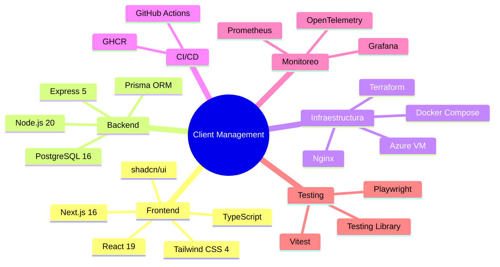

# Documentación

## Índice

| Documento | Descripción |
|---|---|
| [Arquitectura](./architecture.md) | Diagramas de red, stack tecnológico, puertos |
| [Setup](./setup.md) | Instalación local, deploy a Azure, configuración |
| [Docker](./docker.md) | Perfiles, Dockerfiles, compose, comandos |
| [Testing](./testing.md) | Estrategia, tests unitarios, integración, E2E |
| [Monitoreo](./monitoring.md) | OpenTelemetry, Prometheus, Grafana, métricas |
| [CI/CD](./ci-cd.md) | Pipelines de GitHub Actions, secrets, health check |
| [Terraform](./terraform.md) | Módulos, remote state, NSG, outputs |
| [API](./api.md) | Endpoints, modelos, códigos de error |
| [Variables de Entorno](./env-vars.md) | Referencia completa de todas las env vars |

## Stack

