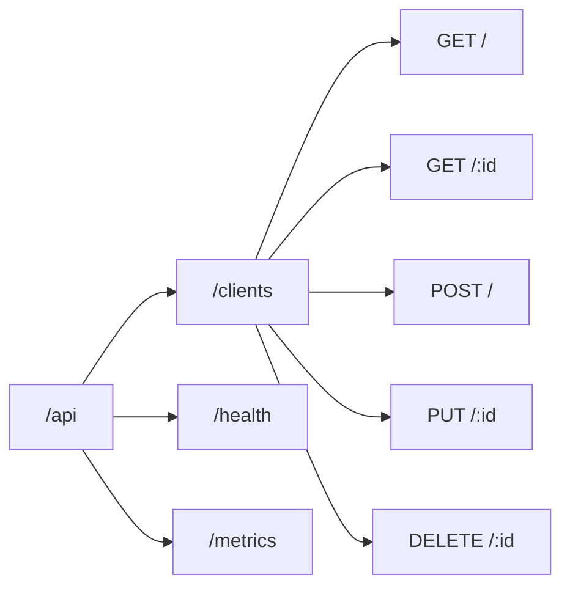
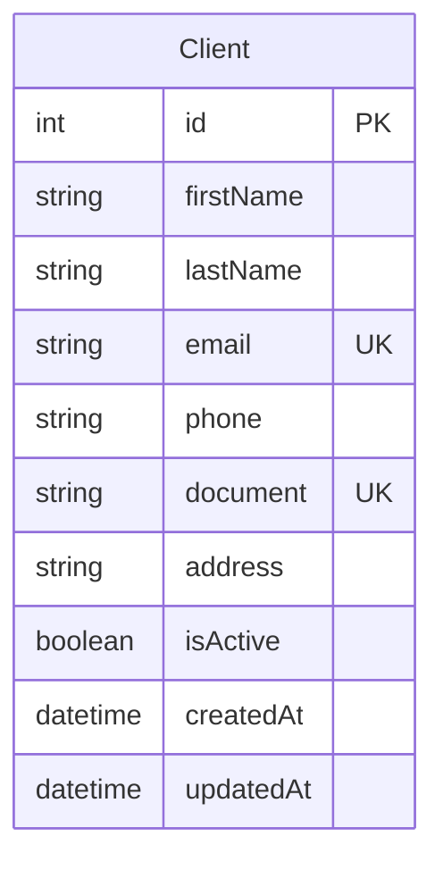
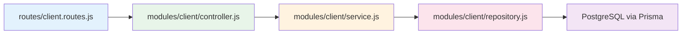

# API REST

## Base URL

| Entorno | URL |
|---|---|
| Desarrollo | `http://localhost:8080/api` |
| Producción | `http://IP/api` |

## Endpoints



### Health Check

```
GET /health
```

```json
{
  "status": "ok",
  "timestamp": "2026-06-23T00:00:00.000Z"
}
```

### Métricas Prometheus

```
GET /metrics
```

Retorna métricas en formato Prometheus text.

### Clientes

#### GET /api/clients

Lista todos los clientes.

```json
[
  {
    "id": 1,
    "firstName": "Juan",
    "lastName": "Pérez",
    "email": "juan@perez.com",
    "phone": "+54 11 5555-0101",
    "document": "DNI 30.123.456",
    "address": "Av. Corrientes 1234",
    "isActive": true,
    "createdAt": "2026-01-01T00:00:00.000Z",
    "updatedAt": "2026-01-01T00:00:00.000Z"
  }
]
```

#### GET /api/clients/:id

Obtiene un cliente por ID.

```json
{
  "id": 1,
  "firstName": "Juan",
  "lastName": "Pérez",
  "email": "juan@perez.com",
  "phone": "+54 11 5555-0101",
  "document": null,
  "address": null,
  "isActive": true,
  "createdAt": "2026-01-01T00:00:00.000Z",
  "updatedAt": "2026-01-01T00:00:00.000Z"
}
```

#### POST /api/clients

Crea un nuevo cliente.

```json
{
  "firstName": "Juan",
  "lastName": "Pérez",
  "email": "juan@perez.com",
  "phone": "+54 11 5555-0101",
  "document": "DNI 30.123.456",
  "address": "Av. Corrientes 1234"
}
```

**Response:** `201 Created`

#### PUT /api/clients/:id

Actualiza un cliente existente. Mismos campos que POST, todos opcionales.

**Response:** `200 OK`

#### DELETE /api/clients/:id

Elimina un cliente.

**Response:** `204 No Content`

## Modelo



## Arquitectura en capas



## Códigos de error

| Código | Descripción |
|---|---|
| 200 | OK |
| 201 | Creado |
| 204 | Sin contenido (DELETE) |
| 404 | Ruta no encontrada |
| 429 | Rate limit excedido (100 req/15min) |
| 500 | Error interno |

## Rate limiting

- **100 requests cada 15 minutos** por IP
- Headers: `RateLimit-*` (standard)
- Configurable via `express-rate-limit` en `app.js`
