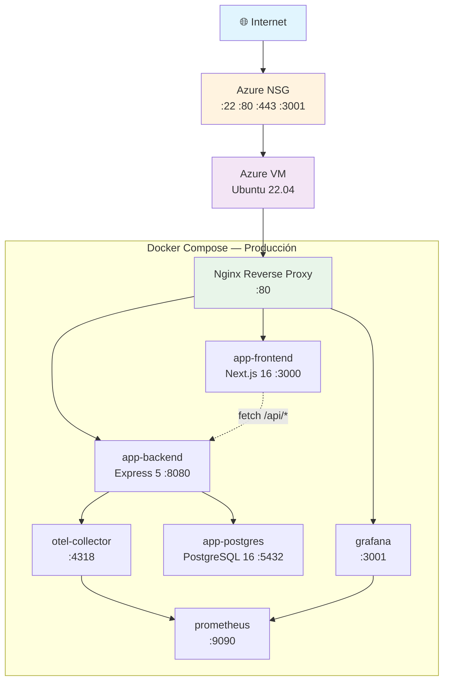
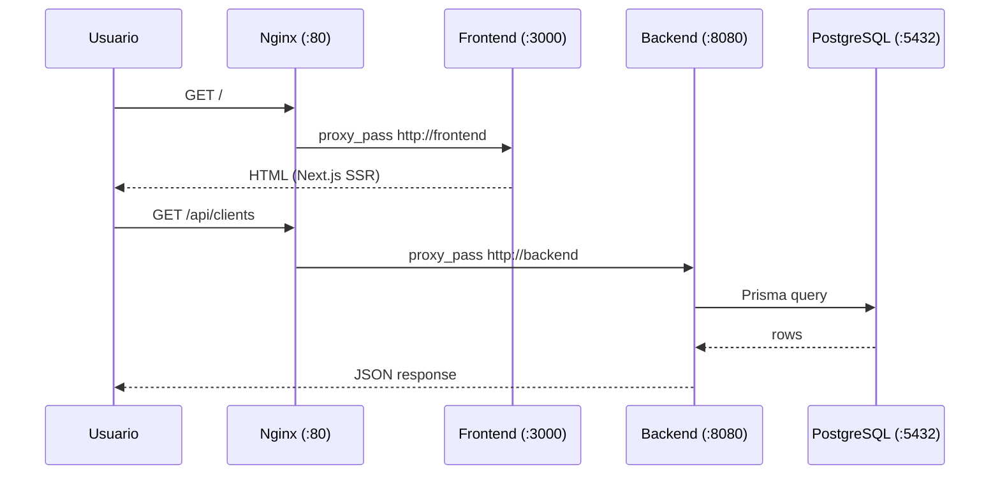
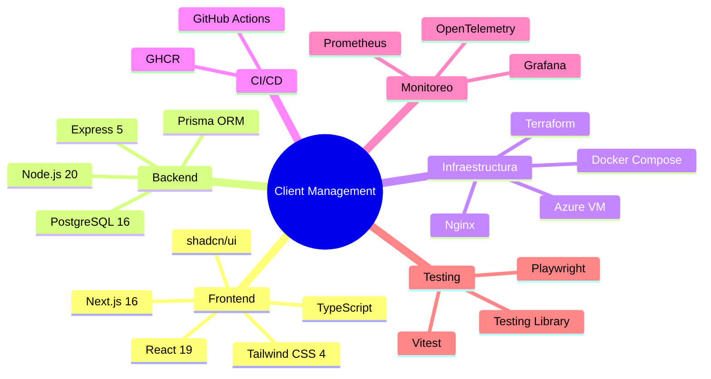
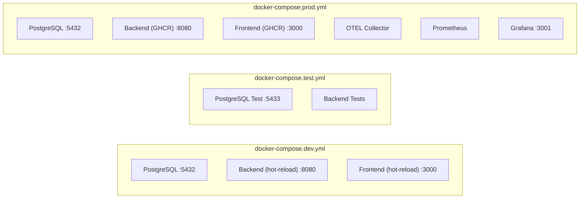

# Arquitectura

## Visión general

## Flujo de red

## Puertos

| Servicio | Container | Host (prod) | Descripción |
|---|---|---|---|
| Frontend | 3000 | 127.0.0.1:3000 | Next.js |
| Backend | 8080 | 127.0.0.1:8080 | Express API |
| PostgreSQL | 5432 | 127.0.0.1:5432 | Base de datos |
| OTEL Collector | 4318 | 127.0.0.1:4318 | Trazas OTLP |
| Prometheus | 9090 | 127.0.0.1:9090 | Métricas |
| Grafana | 3000 | 127.0.0.1:3001 | Dashboards |
| Nginx | — | 0.0.0.0:80 | Reverse proxy |

## Stack tecnológico

## Perfiles de Docker Compose

