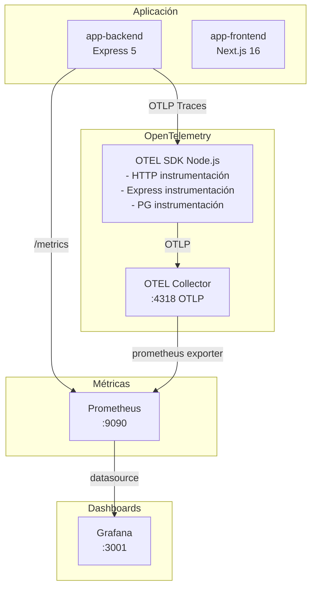

# Monitoreo

## Stack



## OpenTelemetry

### Instrumentación

El backend se instrumenta automáticamente al iniciar con `OTEL_ENABLED=true`:

```javascript
// src/config/telemetry.js
const sdk = new NodeSDK({
  resource: new Resource({
    [SEMRESATTRS_SERVICE_NAME]: env.OTEL_SERVICE_NAME,
  }),
  traceExporter: new OTLPTraceExporter({
    url: env.OTEL_EXPORTER_OTLP_ENDPOINT + "/v1/traces",
  }),
  instrumentations: [
    new HttpInstrumentation(),
    new ExpressInstrumentation(),
    new PgInstrumentation(),
  ],
});
```

### Tipos de datos

| Tipo | Origen | Destino |
|---|---|---|
| Trazas (tracing) | HTTP requests, queries DB | OTEL Collector |
| Métricas (prom-client) | Express (latencia, errores) | Prometheus directo |
| Logs (Pino) | Aplicación | stdout (Docker) |

## Prometheus

### Métricas expuestas

| Métrica | Tipo | Labels | Descripción |
|---|---|---|---|
| `app_http_requests_total` | Counter | method, route, status | Total de requests |
| `app_http_request_duration_seconds` | Histogram | method, route, status | Latencia en buckets |
| `app_db_connections_active` | Gauge | — | Conexiones activas a DB |
| Default metrics | Varios | — | CPU, memoria, GC, event loop |

### Configuración de scrape

```yaml
# infra/monitoring/prometheus.yml
scrape_configs:
  - job_name: "app-backend"
    static_configs:
      - targets: ["app-backend:8080"]
  - job_name: "otel-collector"
    static_configs:
      - targets: ["otel-collector:8889"]
```

## Grafana

### Acceso

```
URL: http://IP_DE_LA_VM:3001
User: admin (configurable via GRAFANA_ADMIN_USER)
Pass: (configurado via GRAFANA_ADMIN_PASSWORD)
```

### Dashboards precargados

El dashboard `App Metrics` incluye:

- **HTTP Request Rate** — requests/segundo por ruta
- **HTTP Request Duration (p95)** — latencia percentil 95
- **Active Database Connections** — conexiones activas
- **Error Rate** — tasa de errores 5xx

### Provisioning

Los dashboards y datasources se configuran automáticamente via archivos YAML:

```yaml
# infra/monitoring/grafana/datasources/prometheus.yml
datasources:
  - name: Prometheus
    type: prometheus
    url: http://prometheus:9090
    isDefault: true
```

## Variables de entorno

| Variable | Default | Descripción |
|---|---|---|
| `OTEL_ENABLED` | `true` | Habilita OpenTelemetry |
| `OTEL_SERVICE_NAME` | `app-backend` | Nombre del servicio en trazas |
| `OTEL_EXPORTER_OTLP_ENDPOINT` | `http://otel-collector:4318` | Endpoint del collector |
| `PROMETHEUS_RETENTION` | `15d` | Retención de métricas |
| `GRAFANA_ADMIN_USER` | `admin` | Usuario admin de Grafana |
| `GRAFANA_ADMIN_PASSWORD` | (requerido) | Password de Grafana |

## Troubleshooting

### Verificar métricas

```bash
# Health check del backend
curl http://localhost:8080/health

# Métricas de Prometheus
curl http://localhost:9090/api/v1/targets

# Métricas de la app
curl http://localhost:8080/metrics | head -20
```

### Verificar OTEL Collector

```bash
docker compose -f docker-compose.prod.yml logs otel-collector
```
