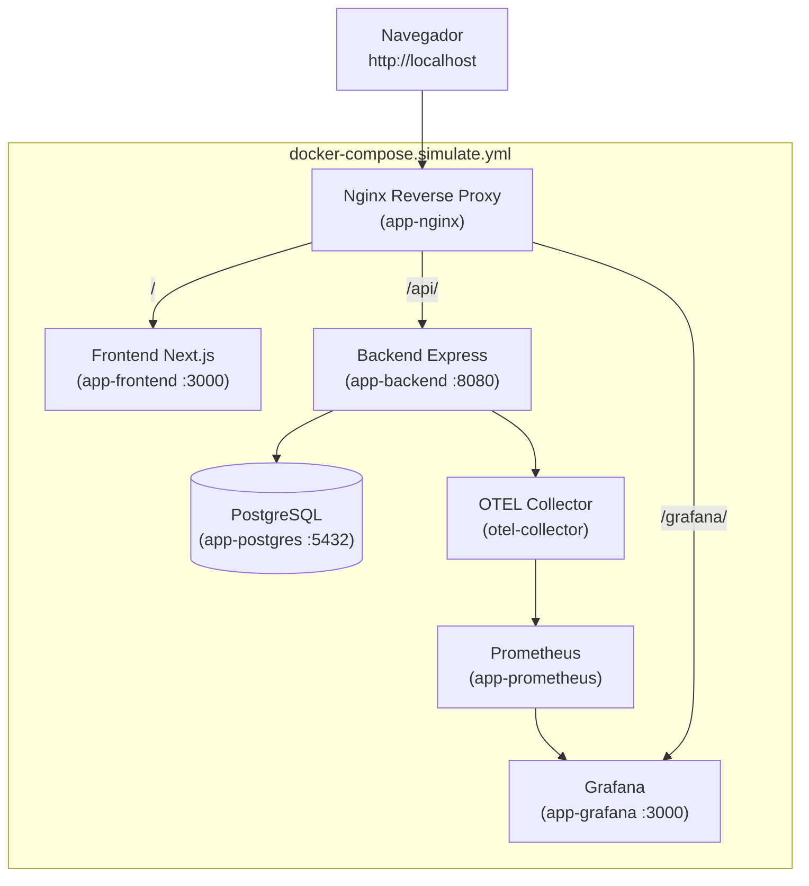

# Simular Azure Localmente

Dos formas de probar el despliegue en Azure sin gastar recursos en la nube.

## Opción A: Stack Completo + Nginx (Recomendada)

Levanta todo el stack de producción localmente con Nginx como reverse proxy,
replicando la configuración del `setup.sh` que se ejecuta en la VM de Azure.

### Requisitos

- [Docker Desktop](https://www.docker.com/products/docker-desktop/)
- Puerto 80 libre (o configurar `NGINX_PORT`)

### Uso

```bash
# Iniciar simulación
make simulate
# o
./run.sh simulate
# o directo:
docker compose -f docker-compose.simulate.yml up --build -d
```

```bash
# Ver logs
make simulate-logs

# Detener
make simulate-down
./run.sh simulate-down
```

### URLs

| Servicio | URL | Nota |
|---|---|---|
| Frontend | `http://localhost` | Via Nginx reverse proxy |
| API | `http://localhost/api/clients` | Via Nginx reverse proxy |
| Health | `http://localhost/health` | Via Nginx |
| Grafana | `http://localhost/grafana` | Via Nginx (admin:admin) |
| Grafana (directo) | `http://localhost:3001` | Acceso directo |
| Prometheus | `http://localhost:9090` | Acceso directo |

### Arquitectura



### Componentes

| Componente | Imagen/Dockerfile | Puerto expuesto |
|---|---|---|
| `app-nginx` | `nginx:alpine` + `infra/nginx/app.conf` | `:80` |
| `app-frontend` | `Dockerfile.prod` (build local) | `:3000` |
| `app-backend` | `Dockerfile.prod` (build local) | `:8080` |
| `app-postgres` | `postgres:16-alpine` | `:5432` |
| `otel-collector` | `otel/opentelemetry-collector-contrib:latest` | `:4318` |
| `app-prometheus` | `prom/prometheus:latest` | `:9090` |
| `app-grafana` | `grafana/grafana:latest` | `:3001` |

### Variables de Entorno

Todas tienen defaults — funciona sin `.env`. Para personalizar:

```bash
cp .env.simulate.example .env.simulate
# editar .env.simulate
docker compose -f docker-compose.simulate.yml --env-file .env.simulate up --build -d
```

### Diferencia con Azure

| Aspecto | Azure | Simulación Local |
|---|---|---|
| Infraestructura | VM + VNet + NSG | Docker Compose |
| Reverse Proxy | Nginx en host (setup.sh) | Nginx container |
| Firewall | UFW en VM | Docker networking |
| SSL | Certbot + Let's Encrypt | No (solo HTTP) |
| Imágenes | GHCR pull | Build local |
| Monitoreo | OTEL + Prometheus + Grafana | Mismo stack |

---

## Opción B: Terraform Local

Valida la configuración de Terraform sin necesidad de una suscripción Azure.

### Validación de sintaxis (sin Azure)

```bash
make terraform-validate
# o:
cd infra/terraform
terraform init -backend=false -reconfigure
terraform fmt -check -recursive
terraform validate
```

### Plan con backend local

Requiere Python 3 (para el script de reemplazo del backend).

```bash
make terraform-local
# o:
cd infra/terraform
sh run-local.sh          # Linux/Mac/Git Bash
.\run-local.ps1          # PowerShell
```

El script:
1. Valida sintaxis con `terraform validate`
2. Reemplaza temporalmente `backend "azurerm"` por `backend "local" {}`
3. Corre `terraform plan` con `terraform.local.tfvars`
4. Restaura el `main.tf` original

### Limitaciones

- `terraform plan` contra backend local no puede verificar recursos Azure reales
- Para un plan completo se necesita `az login` con permisos de lectura en la suscripción
- Los módulos de Azure (`azurerm_resource_group`, `azurerm_virtual_network`, etc.) requieren el provider autenticado
