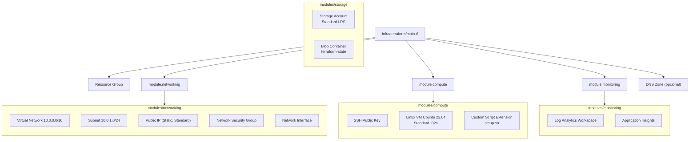
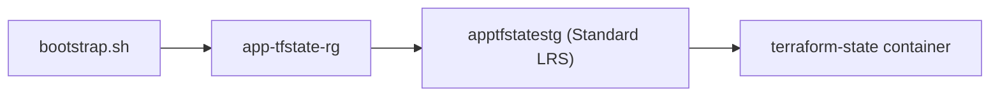
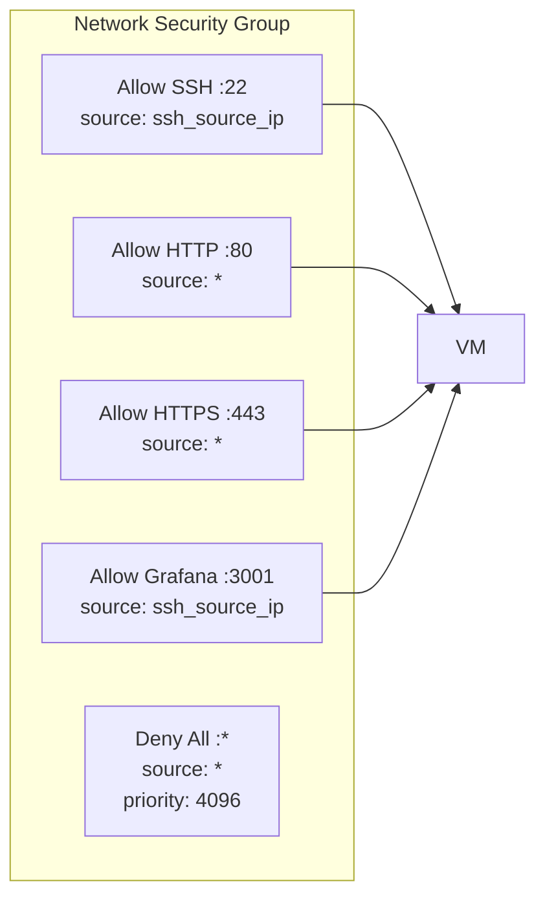

# Terraform — Infraestructura como Código

## Estructura de módulos



## Remote State

El estado de Terraform se almacena en Azure Storage Account.

### Bootstrap (creación inicial)

```bash
cd infra/terraform
./bootstrap.sh
```

Esto crea:



### Configuración

El backend se configura dinámicamente via `backend.hcl` generado por `bootstrap.sh`:

```bash
cd infra/terraform
./bootstrap.sh             # crea storage account + backend.hcl
terraform init -backend-config=backend.hcl
```

Contenido de `main.tf`:
```hcl
terraform {
  backend "azurerm" {}     # config vacía → se completa via -backend-config
}
```

Y `backend.hcl` generado:
```hcl
resource_group_name  = "app-tfstate-rg"
storage_account_name = "apptfstatestg"
container_name       = "terraform-state"
key                  = "app/terraform.tfstate"
```

## Security Rules (NSG)



## Variables

| Variable | Default | Descripción |
|---|---|---|
| `prefix` | `app` | Prefijo para naming |
| `location` | `East US` | Región de Azure |
| `vm_size` | `Standard_B2s` | Tamaño de VM |
| `admin_username` | `azureuser` | Usuario admin |
| `ssh_public_key` | (requerido) | Clave SSH pública |
| `ssh_source_ip` | `*` | IP para SSH |
| `domain_name` | `""` | Dominio opcional |

## Outputs

| Output | Descripción |
|---|---|
| `vm_public_ip` | IP pública de la VM |
| `vm_name` | Nombre de la VM |
| `ssh_command` | Comando SSH listo para copiar |
| `app_url` | URL de la app |
| `grafana_url` | URL de Grafana |
| `application_insights_connection_string` | Connection string de AI (sensitive) |

## Comandos

```bash
cd infra/terraform

# Ver plan
terraform plan

# Aplicar
terraform apply

# Destruir
terraform destroy
```

## Setup Script (cloud-init)

El script `scripts/setup.sh` se ejecuta automáticamente al crear la VM:

1. Actualiza el sistema
2. Instala Docker + Docker Compose
3. Instala Nginx y configura reverse proxy
4. Instala Certbot (SSL)
5. Configura UFW (firewall)
6. Crea estructura de directorios (`/opt/app`)
7. Crea script de deploy (`/opt/app/deploy.sh`)

Ver logs del setup:

```bash
ssh azureuser@IP
cat /var/log/setup.log
```
