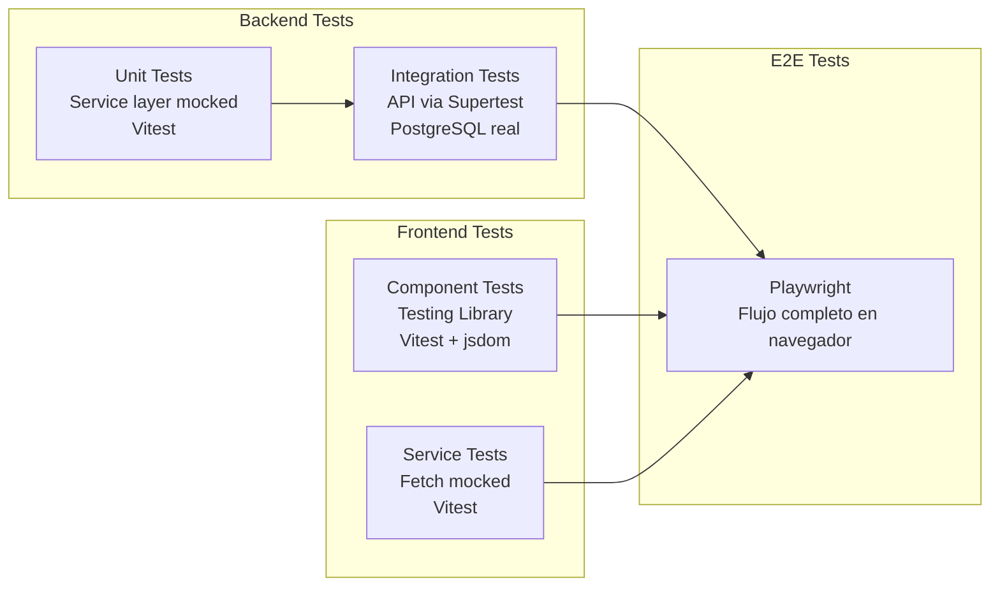
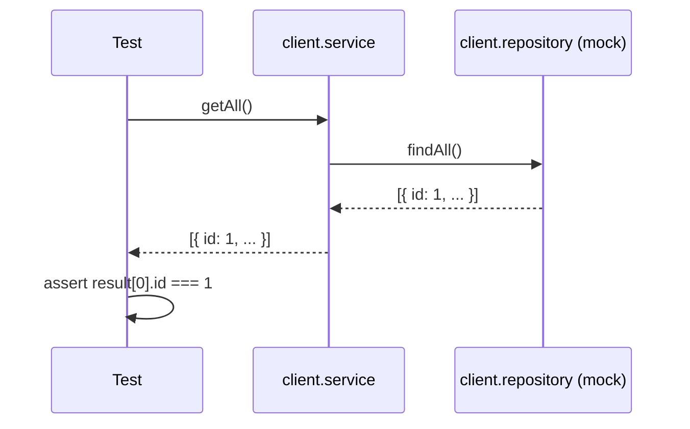
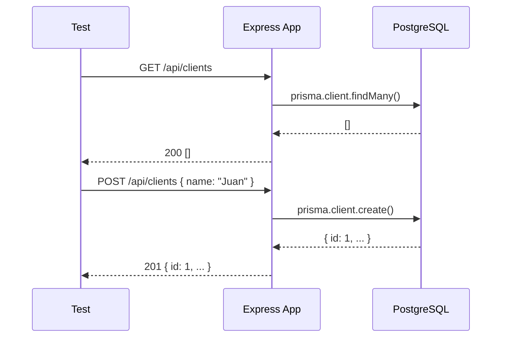
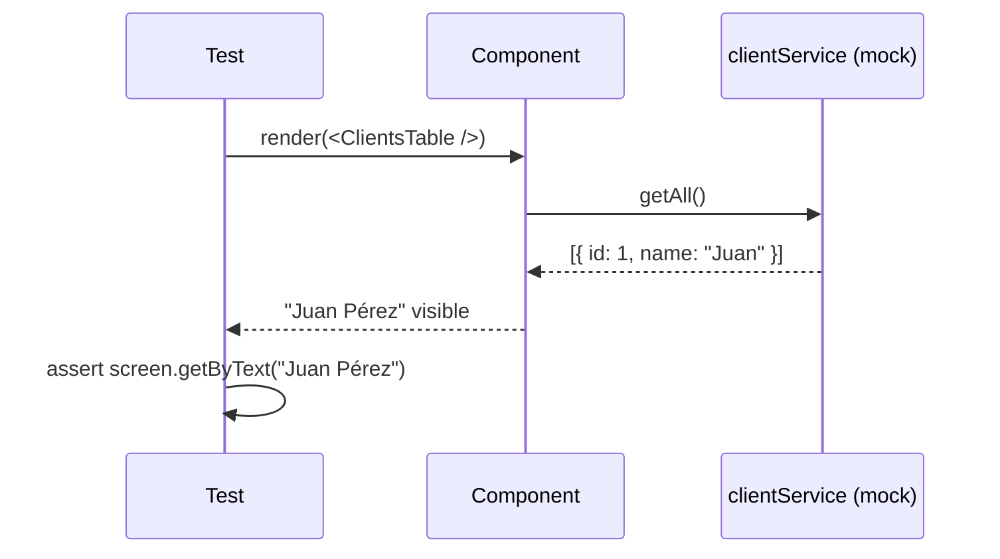
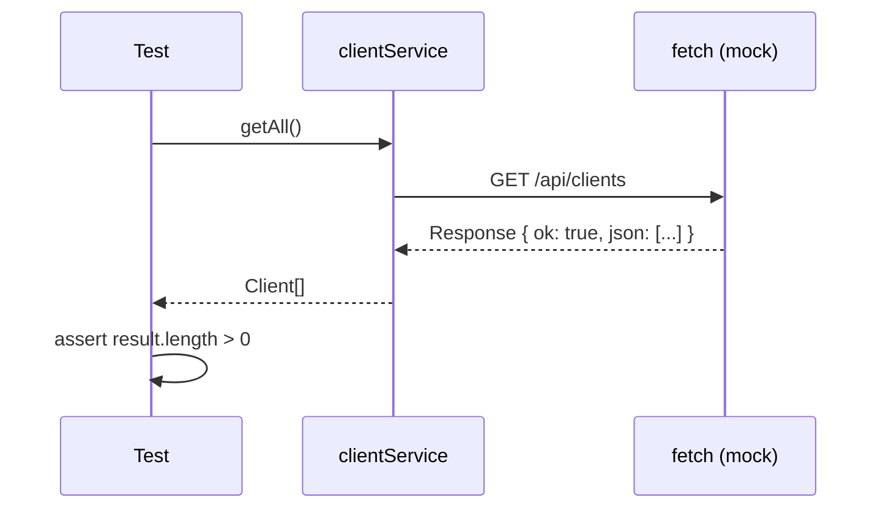
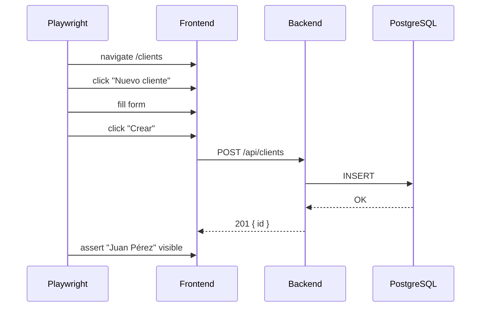

# Testing

## Estrategia



## Backend

### Unit tests (service layer)

ubrcación: `backend/src/modules/client/__tests__/client.service.test.js`

Mockean el repositorio y testean la lógica de negocio:



### Integration tests (API)

Ubicación: `backend/src/modules/client/__tests__/client.api.test.js`

Usan Supertest con la app Express y base de datos real:



### Ejecución

```bash
# Unit tests
cd backend && npx vitest run

# Solo unit
cd backend && npx vitest run src/modules/client/__tests__/client.service.test.js

# Solo API (requiere DB)
cd backend && npx vitest run src/modules/client/__tests__/client.api.test.js

# Con coverage
cd backend && npx vitest run --coverage
```

## Frontend

### Component tests

Ubicación: `frontend/components/clients/__tests__/`

Usan Testing Library con jsdom:



### Service tests

Ubicación: `frontend/services/__tests__/clientService.test.ts`

Mockean `fetch` global:



### Ejecución

```bash
# Todos los tests
cd frontend && npx vitest run

# Watch mode
cd frontend && npx vitest

# Coverage
cd frontend && npx vitest run --coverage
```

## E2E (Playwright)

Ubicación: `e2e/clients.spec.ts`



### Ejecución

```bash
# Necesita entorno dev corriendo
make dev

# Ejecutar E2E
make test-e2e

# Con UI
cd e2e && npx playwright test --ui

# Instalar browsers primero
cd e2e && npm run install
```

## CI/CD Pipeline

```yaml
pull request o push a main:
  lint-backend:
  lint-frontend:
  test-backend:
    - PostgreSQL service container
    - prisma migrate deploy
    - vitest run
  test-frontend:
    - vitest run
  build-and-push:
    needs: [test-backend, test-frontend]
    - docker build & push to GHCR
```

Los tests bloquean el deploy — si fallan, no se construyen ni despliegan imágenes.
